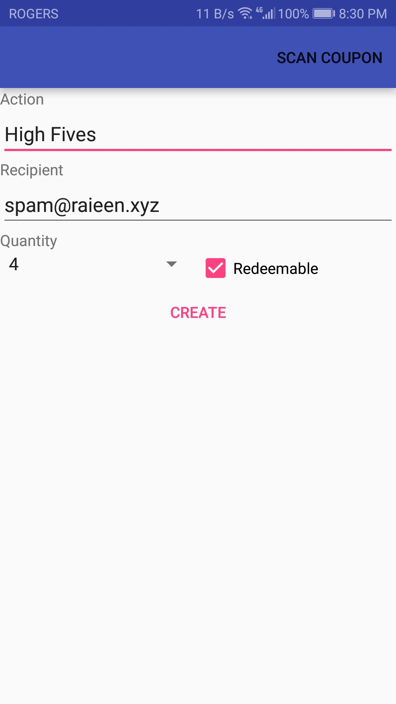
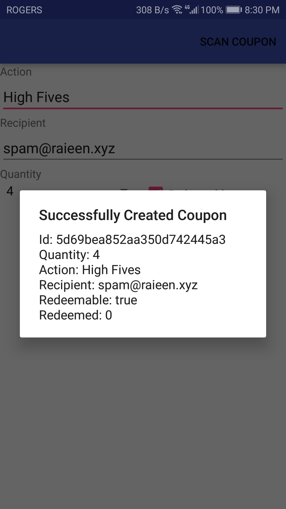
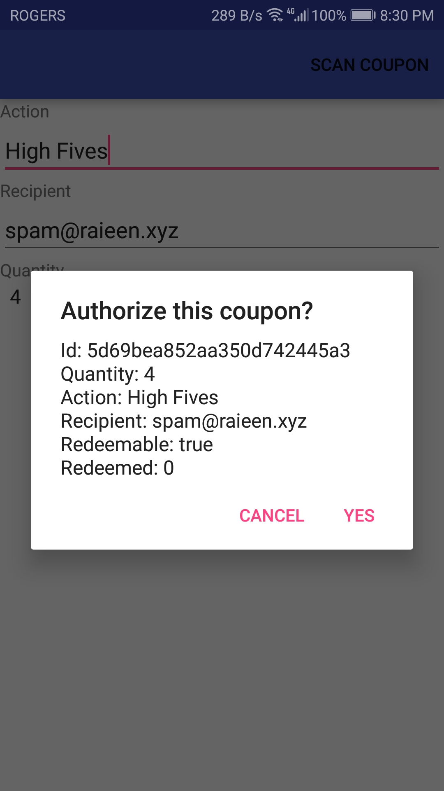

# Coupon App

Goes with [Coupon Web Server](https://github.com/Raieen/CouponWebServer)

Coupon App to create and manage coupons! Ever wanted a overly complicated system to give people meaningless coupons for high fives? Probably not. But you could. Coupon App is an Android app that allows one to create coupons with desired action and quantities. Whenever a coupon is created, an email is sent to the recipient immediately. Coupons can be scanned in the app which redeems them.

Used Volley for interacting with the Coupon Web Server and Zxing for scanning QR codes

## Images

<small>//TODO: Write a better README in the future.</small>

